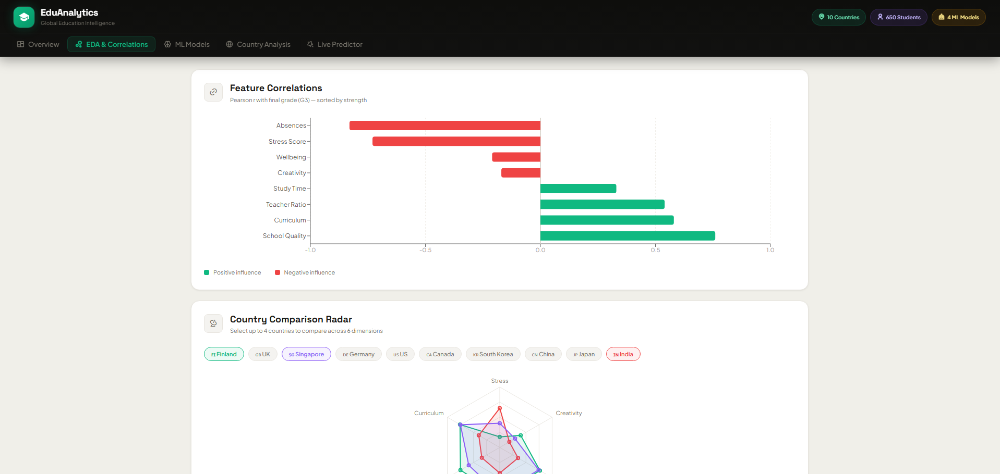

# EduAnalytics — Global Education Intelligence Dashboard

> **Final Year Project · CSE82 · AI-Driven Intelligent Education System Analyzer**

**Frontend**&nbsp;


**Backend / ML Training**&nbsp;


---

## Preview



> *EDA & Correlations tab — Pearson r horizontal bar chart + Country Comparison Radar*

---

## Overview

**EduAnalytics** is an AI-powered education analytics dashboard that analyses academic performance data across **10 countries** and **650 students** using four machine learning models. It surfaces what truly drives student outcomes — from school quality and teacher ratios to stress levels and absenteeism — and generates hybrid model recommendations for underperforming education systems.

---

## Features

| Tab | What it does |
|-----|-------------|
| **Overview** | Hero banner with key metrics, country rankings, and AI hybrid model recommendations |
| **EDA & Correlations** | Pearson r bar chart (sorted by strength) + interactive country radar |
| **ML Models** | R² / RMSE comparison cards + grouped feature importance (RF vs XGBoost) |
| **Country Analysis** | K-Means scatter cluster plot + multi-country radar comparison |
| **Live Predictor** | Real-time grade prediction via interactive sliders |

### Highlights
- Scroll progress indicator on the sticky nav bar
- Interactive country radar — compare up to 4 countries across 6 dimensions
- Custom K-Means scatter tooltip
- Live G3 score predictor with animated result panel
- Dark hero section with ambient glow on Overview
- Fully responsive layout

---

## ML Models & Results

| Model | R² Score | RMSE |
|-------|----------|------|
| Linear Regression | 0.8243 | 0.5916 |
| **Random Forest** | **0.9064** | **0.4318** |
| XGBoost | 0.9019 | 0.4421 |

**Top predictive features:** School Quality (`r = 0.76`) · Curriculum · Teacher Ratio · Absences (`r = -0.83`) · Stress Score

---

## Tech Stack

| Layer | Technology |
|-------|-----------|
| UI Framework | React 18 |
| Build Tool | Vite 6 |
| Styling | SCSS Modules + CSS custom properties |
| Charts | Recharts 2.10 |
| Icons | Remix Icon 4 |
| Fonts | Space Grotesk · Plus Jakarta Sans |
| Deployment | Render |

---

## Architecture — 4-Layer React

```
src/
├── main.jsx                  ← Entry point
├── App.jsx                   ← Layer 1: App shell (nav, layout, scroll progress)
│
├── pages/                    ← Layer 2: Page compositions (route targets)
│   ├── OverviewPage.jsx
│   ├── AnalysisPage.jsx
│   ├── ModelsPage.jsx
│   ├── CountriesPage.jsx
│   └── PredictorPage.jsx
│
├── features/                 ← Layer 3: Self-contained feature modules
│   ├── RankingTable/
│   ├── CorrelationChart/
│   ├── CountryRadar/
│   ├── FeatureImportance/
│   ├── ModelComparison/
│   ├── ClusteringPanel/
│   ├── HybridModel/
│   └── PredictorTool/
│
├── components/               ← Layer 4: Shared UI primitives
│   ├── Card/
│   ├── SectionHeader/
│   └── StatCard/
│
├── core/                     ← Data, constants, utilities
│   ├── data.js
│   ├── constants.js
│   └── utils.js
│
├── hooks/
│   └── useEducationData.js   ← Central data hook (swap to API here)
│
└── styles/                   ← SCSS design system
    ├── _variables.scss       ← Tokens: colors, spacing, radius, shadows
    ├── _mixins.scss
    ├── _base.scss
    └── main.scss
```

---

## Getting Started

### Prerequisites
- Node.js ≥ 18
- npm ≥ 9

### Run Locally

```bash
# Clone the repository
git clone https://github.com/Rudra-CSER/Ai-Education_analyzer_model.git
cd Ai-Education_analyzer_model

# Install dependencies
npm install

# Start development server (http://localhost:5173)
npm run dev
```

### Build for Production

```bash
npm run build      # outputs to /dist
npm run preview    # preview the production build locally
```

---

## Deployment — Render

### Render Project Settings

| Setting | Value |
|---------|-------|
| **Root Directory** | `.` |
| **Build Command** | `npm run build` |
| **Output Directory** | `dist` |
| **Public Directory** | `dist` |
| **Framework Preset** | Vite |

### Deploy via GitHub

```bash
git add .
git commit -m "feat: initial deployment"
git push origin main
```

Then connect the repo on [vercel.com](https://vercel.com) → **Add New Project** → import → **Deploy**.

---

## Data Sources

All data is statically derived from student performance datasets and cross-country education research. Country metrics (stress scores, teacher ratios, wellbeing indices, curriculum scores) are normalised to a 0–10 scale for comparability.

**Countries covered:** Finland · UK · Singapore · Germany · US · Canada · South Korea · China · Japan · India

---

## Notebooks

| File | Description |
|------|-------------|
| `Linear_Regression.ipynb` | Linear regression baseline model |
| `Random_Forest_Analysis.ipynb` | Random Forest with feature importance |
| `XGBoost_Analysis.ipynb` | XGBoost gradient boosting analysis |

---

## Project Info

- **Module:** CSE82 — AI-Driven Intelligent Education System Analyzer  
- **Stack:** React + Vite + SCSS + Recharts + Remix Icon  
- **License:** Academic use only
